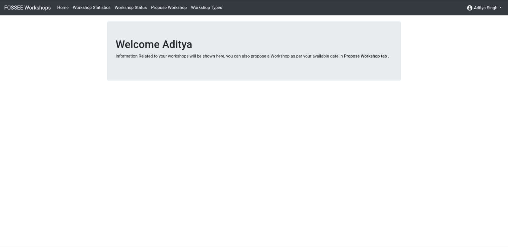
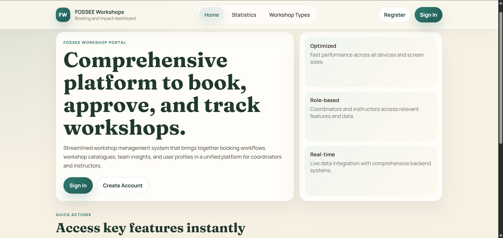
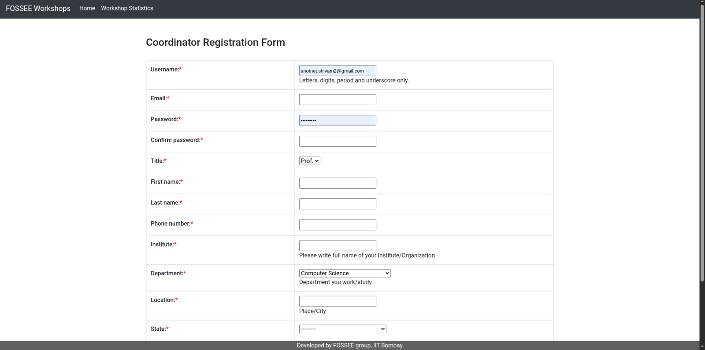
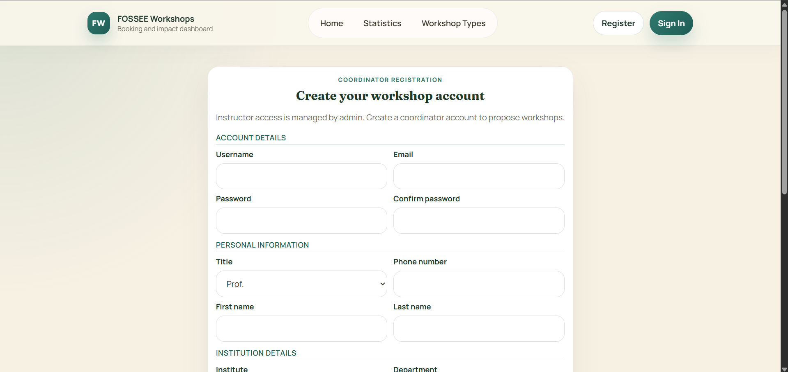
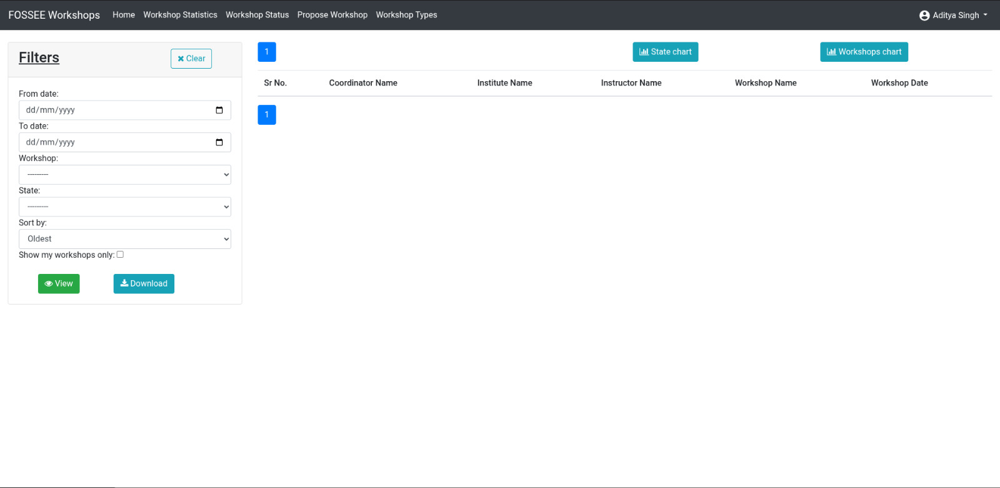
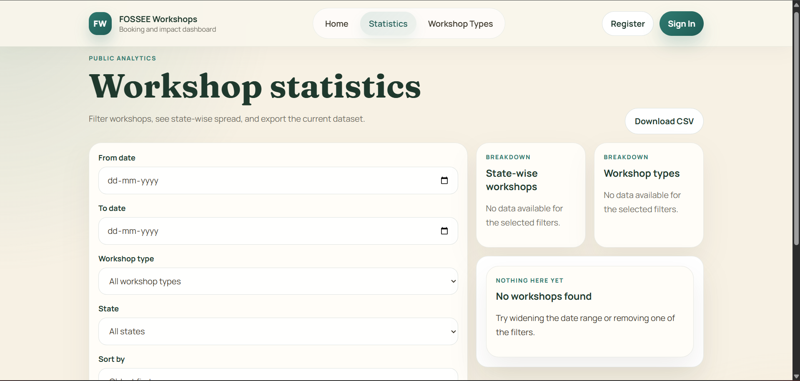
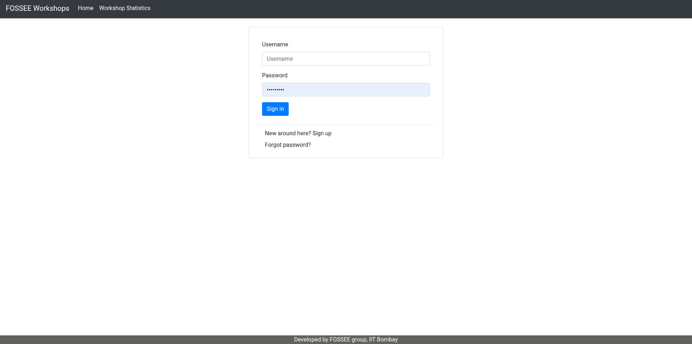
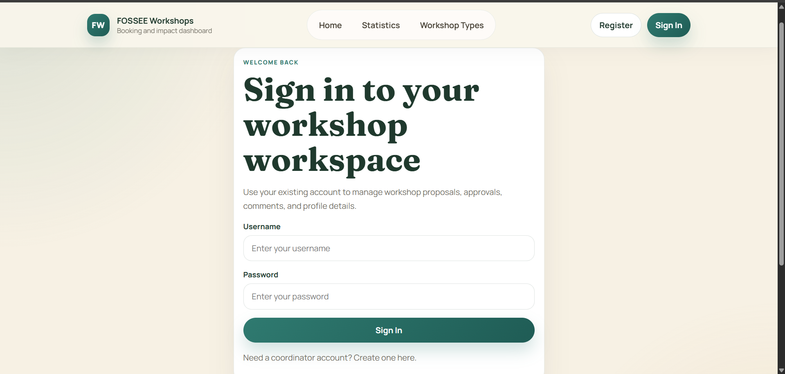

# FOSSEE Workshop Booking System

A workshop booking platform I redesigned for FOSSEE (Free/Libre and Open Source Software for Education). Started with an old Django template-based system and gave it a modern React makeover.

## What This Does

It's basically a system where people can book educational workshops. Coordinators propose workshops, instructors approve them, and everyone can see stats. I took the existing backend and built a completely new frontend that actually looks decent and works on phones.

## Before vs After - What I Changed

### Homepage
<div align="center">
  
  
  <br>
  <em>Left: Original | Right: What I made</em>
</div>

The original homepage looked pretty basic. I made it cleaner with better spacing, modern cards, and a proper layout that works on mobile.

### Registration Form
<div align="center">
  
  
  <br>
  <em>Left: Long scrolling form | Right: Organized sections</em>
</div>

The registration form was way too long - you had to scroll forever to fill it out. I broke it into sections and made it fit on one screen. Much better user experience.

### Statistics Page
<div align="center">
  
  
  <br>
  <em>Left: Basic table view | Right: Better organized dashboard</em>
</div>

The stats page was just a plain table. I added proper filtering, better charts, and organized everything so it's easier to find what you need.

### Login Page
<div align="center">
  
  
  <br>
  <em>Left: Basic form | Right: Clean modern design</em>
</div>

Simple login form got a visual upgrade with better styling and user feedback.

## Tech Stack I Used

**Frontend:**
- React 18 - Because it's what everyone uses and I wanted to learn it properly
- React Router - For page navigation
- Custom CSS - No Bootstrap or anything, wanted full control
- Vite - Super fast development server

**Backend:**
- Django 4.2 - Was already there, just had to connect to it
- SQLite - Simple database for development
- Django REST Framework - For the API endpoints

## How I Approached the Design

### Mobile First
I started designing for phones first, then made it work on bigger screens. Most people probably use this on their phones anyway, so it made sense.

### Keep It Simple
Removed a lot of visual clutter. Used plenty of white space, consistent colors (stuck with the green theme), and made sure everything has a clear purpose.

### Make It Responsive
Used CSS Grid for the complex layouts and Flexbox for simpler stuff. The navbar turns into a hamburger menu on mobile, forms stack properly, and everything scales nicely.

### Component Approach
Instead of writing the same code over and over, I made reusable components. Like a `Button` component that looks the same everywhere, or `FormField` that handles all the input styling.

## Challenges I Faced

### The Registration Form Was Too Long
**Problem:** 13 fields in one long form - nobody wants to scroll through that.
**What I did:** Grouped related fields together (Account Details, Personal Info, Institution Details) and used a two-column layout on desktop. Now it fits on one screen.

### Making It Work on Mobile
**Problem:** The original design didn't work well on phones at all.
**What I did:** Started with mobile layouts first, added a proper hamburger menu, made buttons bigger for touch, and tested everything on different screen sizes.

### Connecting React to Django
**Problem:** The Django backend was built for server-rendered templates, not a React frontend.
**What I did:** Created new API endpoints alongside the old views. Didn't break anything existing, just added what I needed for React.

### Form Handling Was Repetitive
**Problem:** Every form had the same validation and error handling code.
**What I did:** Made a custom `useForm` hook that handles the common stuff. Not as fancy as some libraries, but it works and I understand exactly how it works.

## Design Decisions I Made

### Custom CSS vs Framework
I could have used Bootstrap or Material-UI to go faster, but I wanted to:
- Keep the bundle size small
- Learn CSS properly
- Have complete control over how things look
- Make it match the FOSSEE branding exactly

### Component Structure
Broke big components into smaller pieces:
- `Statistics.jsx` was getting huge, so I split it into `StatisticsFilters`, `StatisticsCharts`, and `WorkshopResults`
- Made reusable form components instead of copying code everywhere
- Created custom hooks for common patterns

### State Management
Used React Context for user authentication (global stuff) and regular state for everything else. Didn't need Redux - the app isn't that complex.

## Trade-offs I Made

### Performance vs Simplicity
I chose simple, readable code over micro-optimizations. The app is fast enough for what it needs to do, and the code is easier to understand and maintain.

### Custom vs Library
Built my own form handling instead of using something like Formik. More work for me, but I know exactly how it works and can fix any issues.

### Development Time vs Control
Writing custom CSS took longer than using a framework, but I got exactly the design I wanted and a smaller bundle size.

## What I Learned

- Mobile-first design really does make things easier
- Breaking components into small pieces makes everything more manageable
- Custom hooks are super useful for avoiding repetitive code
- CSS Grid is amazing for responsive layouts
- Starting with a working backend made the frontend development much smoother

## How to Run This

### Backend Setup
```bash
# Clone and setup Python environment
git clone <repo-url>
cd workshop_booking
python -m venv venv
source venv/bin/activate  # Windows: venv\Scripts\activate

# Install dependencies and setup database
pip install -r requirements.txt
python manage.py migrate
python manage.py runserver
```

### Frontend Setup
```bash
# In a new terminal
cd frontend
npm install
npm run dev
```

Backend runs on `http://localhost:8000`, frontend on `http://localhost:5173`

## Things I'd Improve Next

- Add proper error boundaries so the app doesn't crash completely if something breaks
- Write more tests (I know, I know...)
- Add some accessibility features like keyboard navigation
- Maybe add offline support with service workers
- Real-time notifications would be cool

## Notes

- This was a learning project, so the code isn't perfect
- Email activation links show up in the Django console during development
- The app expects the Django API to be running on port 8000

The main goal was to take something that worked but looked outdated and make it modern and mobile-friendly. I think I succeeded in that, even if there's still room for improvement!