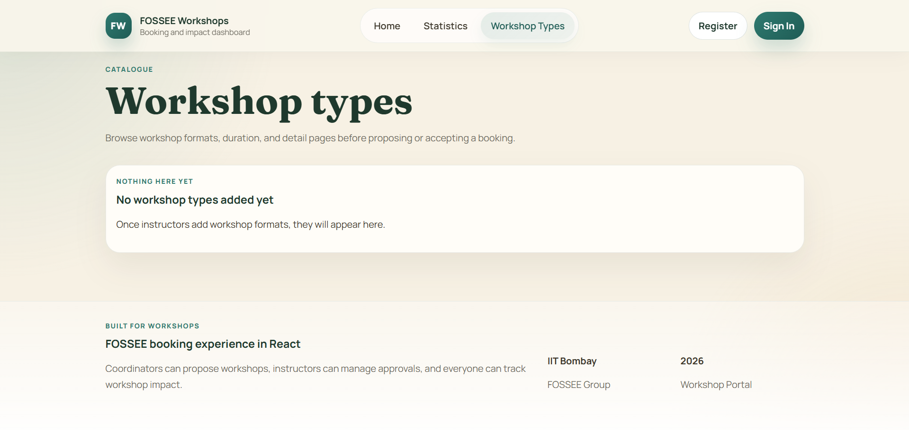

# FOSSEE Workshop Booking System

A modern workshop booking and management platform built for FOSSEE (Free/Libre and Open Source Software for Education). This project started as a Django-based system and has been redesigned with a React frontend to provide a better user experience.

## What This Project Does

This is a workshop booking system where coordinators can propose workshops, instructors can manage them, and everyone can view statistics. Think of it like an event management system but specifically designed for educational workshops.

The main goal was to take the existing Django backend and give it a modern, responsive frontend that actually looks good and works well on mobile devices.

## Visual Showcase

### Before vs After Comparison

#### Homepage Transformation
<div align="center">
  
  
  <br>
  <em>Left: Original homepage | Right: Modern redesigned homepage</em>
</div>

#### Registration Form Enhancement
<div align="center">
  
  
  <br>
  <em>Left: Original long form | Right: Compact sectioned form</em>
</div>

#### Statistics Dashboard Improvement
<div align="center">
  
  
  <br>
  <em>Left: Basic statistics view | Right: Enhanced dashboard with better UX</em>
</div>

#### Sign In Page Modernization
<div align="center">
  
  
  <br>
  <em>Left: Original login form | Right: Clean modern design</em>
</div>

#### Workshop Types Enhancement
<div align="center">
  
  <br>
  <em>Modern workshop types listing with improved card design</em>
</div>

## Design Principles & Approach

### What Design Principles Guided Your Improvements?

**1. Mobile-First Responsive Design**
- Started with mobile layouts and progressively enhanced for larger screens
- Ensured touch-friendly interface elements (minimum 44px touch targets)
- Prioritized content hierarchy for small screens first

**2. Clean Visual Hierarchy**
- Used consistent typography scale (headings, body text, captions)
- Implemented proper spacing system using CSS custom properties
- Applied the 60-30-10 color rule (neutral base, accent colors, highlights)

**3. Minimalist Interface Design**
- Removed unnecessary visual clutter and decorative elements
- Focused on content-first approach with plenty of whitespace
- Used subtle shadows and borders instead of heavy visual elements

**4. Consistent Component System**
- Created reusable UI components (Button, Card, Input, etc.)
- Maintained consistent styling patterns across all pages
- Implemented a unified color scheme and spacing system

**5. User-Centered Experience**
- Grouped related functionality together (form sections, navigation)
- Provided clear feedback for user actions (loading states, error messages)
- Optimized common user flows (registration, login, workshop management)

### How Did You Ensure Responsiveness Across Devices?

**CSS Grid & Flexbox Strategy:**
```css
/* Mobile-first approach */
.form-row {
  display: grid;
  grid-template-columns: 1fr; /* Single column on mobile */
  gap: 0.75rem;
}

@media (min-width: 768px) {
  .form-row {
    grid-template-columns: 1fr 1fr; /* Two columns on tablet+ */
  }
}
```

**Responsive Navigation:**
- Implemented hamburger menu for mobile devices
- Used CSS transforms for smooth menu animations
- Desktop navigation shows all links horizontally

**Flexible Typography:**
- Used relative units (rem, em) instead of fixed pixels
- Implemented responsive font scaling
- Ensured readable text on all screen sizes

**Touch-Friendly Design:**
- Minimum 44px touch targets for buttons and links
- Adequate spacing between interactive elements
- Optimized form inputs for mobile keyboards

**Viewport Optimization:**
- Added viewport meta tag for proper mobile rendering
- Used CSS media queries for different screen breakpoints
- Tested on various device sizes using browser dev tools

### What Trade-offs Did You Make Between Design and Performance?

**Custom CSS vs Framework:**
- **Trade-off:** Wrote custom CSS instead of using Bootstrap/Material-UI
- **Benefit:** Smaller bundle size, complete design control
- **Cost:** More development time, need to maintain custom styles

**Component Granularity:**
- **Trade-off:** Created many small components vs fewer large ones
- **Benefit:** Better reusability, easier maintenance
- **Cost:** Slightly more complex file structure

**Animation & Transitions:**
- **Trade-off:** Added smooth animations for better UX
- **Benefit:** More polished, professional feel
- **Cost:** Minor performance impact on older devices

**Image Optimization:**
- **Trade-off:** Used modern image formats where possible
- **Benefit:** Faster loading times
- **Cost:** Need fallbacks for older browsers

**Bundle Size Considerations:**
- **Trade-off:** Custom hooks vs external libraries
- **Benefit:** Smaller bundle, better understanding of code
- **Cost:** More code to maintain, potential bugs

### What Was the Most Challenging Part and How Did You Approach It?

**Challenge 1: Making the Registration Form Compact**
- **Problem:** 13 form fields created a very long, overwhelming form
- **Approach:** 
  - Grouped related fields into logical sections
  - Used CSS Grid to create two-column layouts
  - Added visual section headers for better organization
  - Implemented responsive design that stacks on mobile

**Challenge 2: Navbar Responsiveness**
- **Problem:** Desktop navigation disappeared after component refactoring
- **Approach:**
  - Debugged CSS media queries and component structure
  - Added `!important` declarations where needed
  - Extracted reusable components while maintaining functionality
  - Tested across different screen sizes

**Challenge 3: Maintaining Design Consistency**
- **Problem:** Different pages had inconsistent styling patterns
- **Approach:**
  - Created a design system with reusable components
  - Established CSS custom properties for colors and spacing
  - Built custom hooks for common patterns (useForm, useAsync)
  - Documented component usage patterns

**Challenge 4: Balancing Modern Design with Existing Backend**
- **Problem:** Backend APIs weren't designed for modern frontend patterns
- **Approach:**
  - Created service layer to abstract API calls
  - Added proper error handling and loading states
  - Maintained backward compatibility with existing endpoints
  - Gradually improved API responses without breaking changes

## Tech Stack

**Frontend:**
- React 18 - For building the user interface
- React Router - For navigation between pages
- CSS3 - Custom styling (no heavy frameworks, kept it simple)
- Vite - Development server and build tool

**Backend:**
- Django 4.2 - REST API and business logic
- SQLite - Database (easy for development)
- Django REST Framework - API endpoints
- Email integration - For account activation

**Why These Choices:**
- React because it's popular and I wanted to learn it properly
- Django because the backend was already there and working
- Custom CSS instead of frameworks to keep bundle size small and have full control
- Vite because it's fast and the hot reload is really nice

## Frontend Implementation

### Project Structure
```
frontend/src/
├── components/
│   ├── common/          # Reusable components (LoadingState, EmptyState, etc.)
│   ├── forms/           # Form-related components (FormField, FormGrid)
│   ├── layout/          # Layout components (Navbar, Footer)
│   ├── statistics/      # Statistics-specific components
│   └── ui/              # Basic UI components (Button, Card, Input)
├── context/             # React Context for auth
├── hooks/               # Custom hooks (useForm, useAsync)
├── pages/               # Main page components
├── services/            # API calls and business logic
└── styles/              # Global styles
```

### Component Architecture
I tried to keep components small and focused. Instead of having huge components, I broke them down:
- `Statistics.jsx` was getting too big, so I split it into `StatisticsFilters`, `StatisticsCharts`, and `WorkshopResults`
- Created reusable form components to avoid repeating the same input patterns
- Made custom hooks for common patterns like form handling and API calls

### Styling Approach
- **Mobile-first design** - Started with mobile layouts, then added desktop styles
- **CSS custom properties** for consistent theming
- **Component-scoped styles** - Each component has its own CSS file
- **Responsive grid layouts** using CSS Grid and Flexbox
- **Smooth animations** for better user experience (nothing too fancy though)

### Responsiveness
- Used CSS Grid for complex layouts that adapt to screen size
- Hamburger menu for mobile navigation
- Flexible card layouts that stack on smaller screens
- Touch-friendly button sizes on mobile
- Tested on different screen sizes (though mostly just browser dev tools)

### UI/UX Improvements
- **Clean, minimal design** - Removed clutter and focused on content
- **Better visual hierarchy** - Used typography and spacing to guide users
- **Consistent color scheme** - Green theme matching FOSSEE branding
- **Loading states** - Users know when something is happening
- **Error handling** - Clear error messages instead of just failing silently
- **Smooth transitions** - Makes the app feel more polished

## Backend Integration

### API Connection
The React app talks to Django through REST APIs. I created service files to handle all API calls:
- `authService.js` - Login, register, logout
- `workshopService.js` - Workshop CRUD operations
- `statisticsService.js` - Data for charts and reports

### Authentication Flow
1. User registers with email and personal details
2. Django sends activation email (in development, the link also shows in console)
3. User clicks activation link to verify email
4. User can then login normally
5. JWT tokens handle session management

The frontend stores auth state in React Context, so components can easily check if user is logged in and what permissions they have.

### Error Handling
I made a custom `useAsync` hook that handles loading states and errors consistently across the app. It's not perfect but it works better than having try-catch blocks everywhere.

## Features

- **Modern, responsive UI** that works on phones and desktops
- **User authentication** with email verification
- **Workshop management** - propose, accept, reschedule workshops
- **Statistics dashboard** with charts and filtering
- **Profile management** - update personal information
- **Role-based access** - different features for coordinators vs instructors
- **Mobile-friendly navigation** with hamburger menu
- **Real-time form validation** with helpful error messages

## Challenges & Solutions

### Challenge: Making the Old Django Views Work with React
**Problem:** The Django backend had template-based views, but React needed JSON APIs.
**Solution:** Created new API views alongside the old ones. Marked the old views as "legacy" so they can be removed later. This way nothing broke during the transition.

### Challenge: Form Handling
**Problem:** Every form was repeating the same validation and error handling logic.
**Solution:** Made a `useForm` custom hook that handles common form patterns. Not as fancy as Formik, but it works for this project.

### Challenge: Mobile Navigation
**Problem:** The original navbar didn't work well on mobile.
**Solution:** Implemented a hamburger menu with smooth animations. Took a while to get the CSS transitions right, but it looks pretty good now.

### Challenge: Responsive Design
**Problem:** Making layouts work on different screen sizes without looking broken.
**Solution:** Used CSS Grid for complex layouts and Flexbox for simpler ones. Started with mobile designs first, then added desktop styles. Still not perfect on all devices, but it's much better than before.

## Trade-offs

### Simplicity vs Performance
I chose simplicity over micro-optimizations. For example, I'm not using React.memo everywhere or optimizing every re-render. The app is fast enough for the expected user base, and the code is easier to understand.

### Custom Components vs Libraries
I built custom form components instead of using a library like react-hook-form. This means more code to maintain, but it also means I understand exactly how everything works.

### CSS Approach
Writing custom CSS takes longer than using a framework, but it gives more control over the final design. The bundle size is smaller, and the styles are exactly what we need.

## Setup Instructions

### Prerequisites
- Node.js (I used v18, but v16+ should work)
- Python 3.8+
- Git

### Backend Setup
1. Clone the repository:
   ```bash
   git clone <repository-url>
   cd workshop_booking
   ```

2. Create a virtual environment:
   ```bash
   python -m venv venv
   source venv/bin/activate  # On Windows: venv\Scripts\activate
   ```

3. Install Python dependencies:
   ```bash
   pip install -r requirements.txt
   ```

4. Run migrations:
   ```bash
   python manage.py migrate
   ```

5. Create a superuser (optional):
   ```bash
   python manage.py createsuperuser
   ```

6. Start the Django server:
   ```bash
   python manage.py runserver
   ```

The backend will run on `http://localhost:8000`

### Frontend Setup
1. Navigate to the frontend directory:
   ```bash
   cd frontend
   ```

2. Install dependencies:
   ```bash
   npm install
   ```

3. Start the development server:
   ```bash
   npm run dev
   ```

The frontend will run on `http://localhost:5173` (or another port if 5173 is busy)

### Development Notes
- The frontend expects the Django API to be running on `http://localhost:8000`
- In development, email activation links are also printed to the Django console
- You can check `workshop_app/logs/last_activation_link.txt` for the latest activation link

## Future Improvements

If I had more time, here's what I'd work on:

- **Better error boundaries** - Right now if something breaks, the whole app might crash
- **More comprehensive testing** - I wrote some tests but not enough
- **Performance optimization** - Add React.memo and useMemo where it actually matters
- **Accessibility improvements** - Better keyboard navigation and screen reader support
- **Offline support** - Cache some data so the app works without internet
- **Real-time updates** - WebSocket integration for live notifications
- **Better mobile experience** - Native app feel with PWA features

## Contributing

This is a learning project, so the code isn't perfect. If you find bugs or have suggestions, feel free to open an issue or submit a PR. Just keep in mind that I'm still learning React, so be patient with the code quality!

## License

This project is part of FOSSEE and follows their licensing terms.